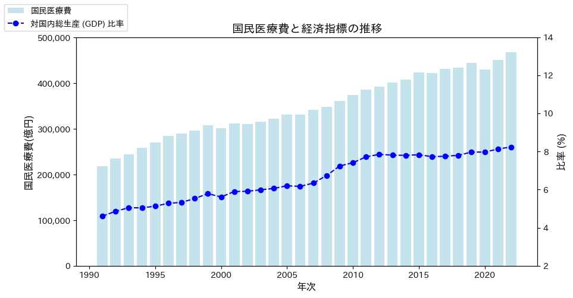

# 国民医療費について(2022年)

- 更新日:2025/02/09

## 国民医療費とGDP
- 国民医療費について
- 2022年の国民医療費は46.6兆円
- GDPに締める割合は8.24%
- 2000年に比べ1.54倍

|年次|国民医療費 (億円)|人口一人当たり国民医療費 (千円)|GDP (億円)|国民医療費/GDP (%)|
|:----|:----|:----|:----|:----|
|2000|301,418|237.5|5,376,142|5.61|
|2020|429,665|340.6|5,390,091|7.97|
|2021|450,359|358.8|5,536,423|8.13|
|2022|466,967|373.7|5,664,897|8.24|

## 参考
- https://www.mhlw.go.jp/toukei/saikin/hw/k-iryohi/22/dl/data.pdf
- https://www.mhlw.go.jp/toukei/saikin//hw/k-iryohi/22/index.html