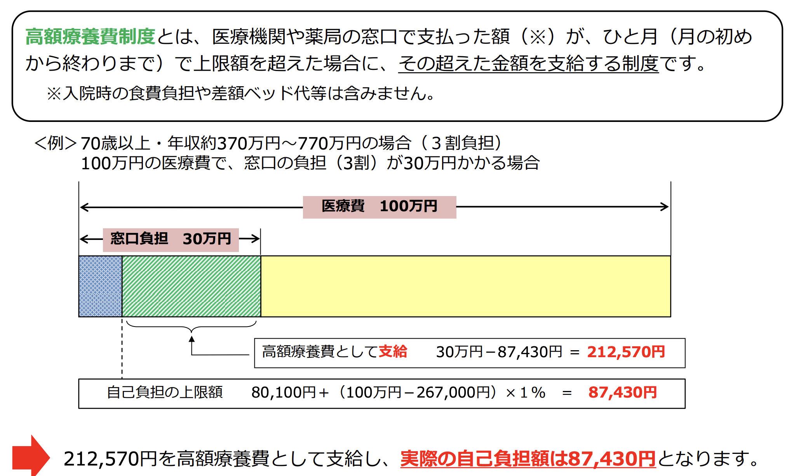
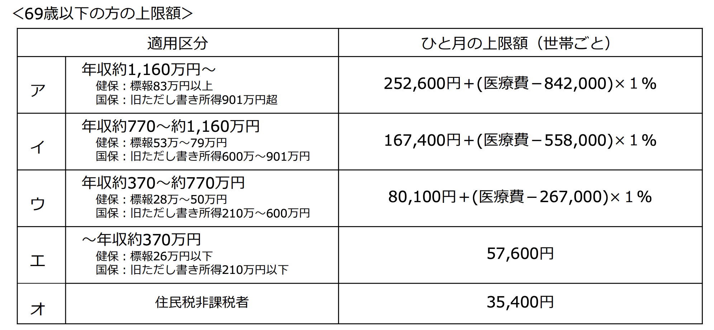
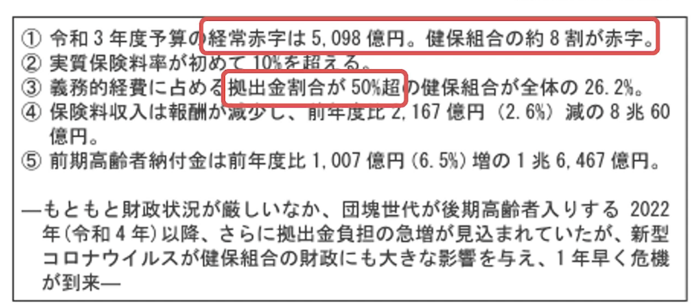
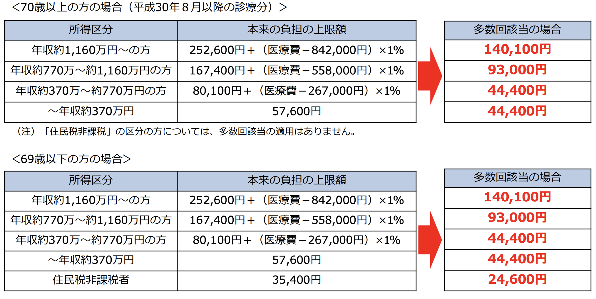

# 高額療養費制度について

- 更新日:2025/02/09

## 高額療養費制度について
- 医療費の家計負担が重くならないよう、医療機関や薬局の窓口で支払う医療費が１か月で上限額を超えた場合、その超えた額を支給する制度。

- カテーテルによる大動脈弁置換術（TAVI）の費用は、1回の治療で約6,000万円程度
- 高額療養費制度を利用可能

- plusα：保健健保組合によって付加給付があり、より負担額が減る
- しかし、付加給付の財源が確保できていない状況がある？

## 多数回該当
- 過去12か月以内に３回以上、上限額に達した場合は、４回目から「多数回」該当とな
り、上限額が下がります。

## 参考
- 